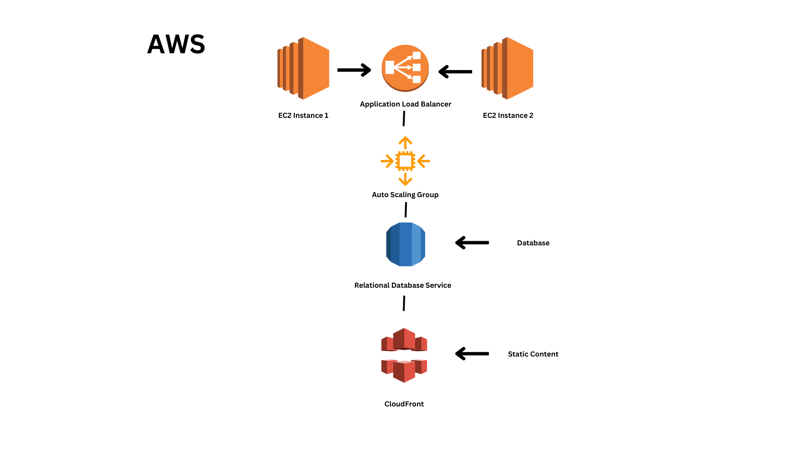

High Availability Web Application with Load Balancing and Auto Scaling on AWS

Project Overview
This project demonstrates how to build a highly available and scalable web application using AWS services. It includes the following components:
- EC2 Instances (Web Servers)
- Application Load Balancer (ALB)
- Auto Scaling Groups (ASG)
- RDS (Relational Database Service) for database management
- CloudFront for faster content delivery

Architecture Diagram

Setup Instructions

1. Launch EC2 Instances
- Go to the EC2 Dashboard in AWS and launch Ubuntu 22.04 or Amazon Linux 2023.
- Install Apache or Nginx using the provided bash scripts.
- SSH into your instances and test them with a simple web page.

2. Set Up Application Load Balancer (ALB)
- Follow the AWS console instructions to create an ALB.
- Attach EC2 instances to the ALB and test the traffic distribution.

3. Configure Auto Scaling
- Set up an Auto Scaling Group (ASG) to manage instance count based on CPU utilization.

4. Set Up Amazon RDS
- Launch a MySQL or PostgreSQL RDS instance and connect it to your EC2 web servers.

5. Set Up CloudFront
- Configure CloudFront to cache static assets and improve content delivery speed.

Technologies Used:
- AWS EC2
- AWS ALB
- AWS Auto Scaling
- AWS RDS
- AWS CloudFront
- Linux (Ubuntu 22.04)
- Apache Web Server
- Bash Scripting

License
This project is licensed under the MIT License.
